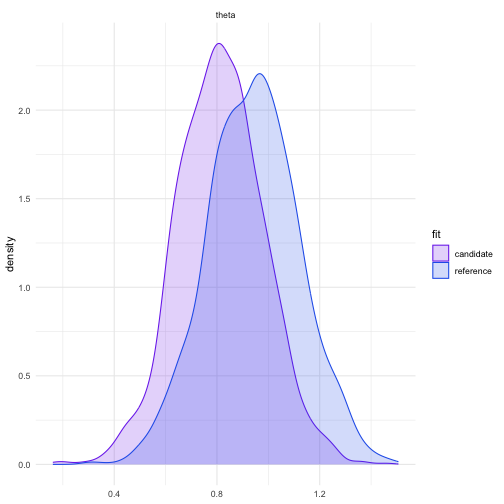
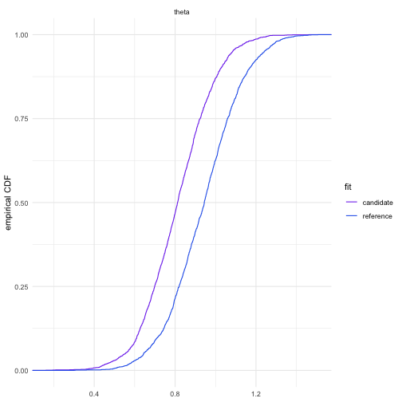

# fd-sens (R/Stan-based)

A minimal R package for Fisher-divergence global sensitivity analysis using a reference posterior fitted with Stan.

Complete methodology is described in [*A computationally-tractable measure of global sensitivity for sampling-based Bayesian inference*](https://arxiv.org/abs/2605.28099).
See [`GETTING_STARTED.md`](GETTING_STARTED.md) for details.

## Installation

This is not a package published on CRAN, so you first need to clone the repository and then install it from that local copy.

1. Clone the repository and move into it:

```sh
git clone https://github.com/jularina/fd-sens-r.git
cd fd-sens-r
```

2. Install the package from source:

```r
install.packages(".", repos = NULL, type = "source")
```

Install `cmdstanr` and CmdStan separately by following the [`cmdstanr` installation guide](https://mc-stan.org/cmdstanr/articles/cmdstanr.html).

## Quickstart (Gaussian location model)

1) Model is defined in `gaussian_location.stan`:

```stan
data {
  int<lower=1> N;
  vector[N] y;
  real prior_mean;
  real<lower=0> prior_sd;
}
parameters {
  real theta;
}
model {
  theta ~ normal(prior_mean, prior_sd);
  y ~ normal(theta, 1);
}
```

2) Fit model with `cmdstanr` and 3) measure sensitivity:

```r
library(cmdstanr)
library(fdsens)

set.seed(123)
stan_file <- system.file("stan", "gaussian_location.stan", package = "fdsens")
fit <- cmdstan_model(stan_file)$sample(
  data = list(N = 30, y = rnorm(30, mean = 1), prior_mean = 0, prior_sd = 2),
  seed = 123, chains = 2, parallel_chains = 2,
  iter_warmup = 500, iter_sampling = 1000, refresh = 0
)

result <- fd_prior_global_sensitivity(
  fit, variables = "theta",
  lambda_lower = c(eta1 = -1, eta2 = -2), lambda_upper = c(eta1 = 1, eta2 = -0.05),
  stan_file = stan_file, prior_variable = "theta",
  stan_data = list(prior_mean = 0, prior_sd = 2)
)
print(result)
#> FD prior sensitivity
#>   optimisation: quadratic_corner
#>   sensitivity: 20.976
#>   minimum FD:  0 at lambda_min = (eta1 = 0, eta2 = -0.125)
#>   maximum FD:  20.976 at lambda_max = (eta1 = -1, eta2 = -2)
```

(`eta1`/`eta2` are the normal prior's natural parameters; see [Exponential-family route](#exponential-family-route) below.)

Returned `result$sensitivity` is the largest possible change in the posterior, and `result$lambda_max` - the worst-case prior that produces it. 

Refitting at `lambda_max` and comparing the two posteriors confirms it — the candidate visibly shifts and tightens `theta`:
<p align="center">
  
  
</p>

The full runnable script is at [`examples/gaussian_location_prior_sensitivity.R`](examples/gaussian_location_prior_sensitivity.R), and [`notebooks/gaussian_location_prior_sensitivity.md`](notebooks/gaussian_location_prior_sensitivity.md) walks through it step by step.

## Repository Contents

| Path | What's there                                                                                                                                                                                                                           |
| --- |----------------------------------------------------------------------------------------------------------------------------------------------------------------------------------------------------------------------------------------|
| [`R/`](R) | Core functions: `fd_prior_global_sensitivity()`, `fd_lr_global_sensitivity()`, the underlying FD estimator in `fd_sensitivity.R`, the exponential-family prior registry in `stan_exponential_family_priors.R`, and supporting helpers. |
| [`inst/stan/`](inst/stan) | The `.stan` reference models (e.g. `gaussian_location.stan`).                                                                                                                                                                          |
| [`examples/`](examples) | Example scripts (`Rscript examples/<name>.R`) covering prior sensitivity, learning-rate sensitivity, and sensitivity decomposition over independent prior blocks.                                                                      |
| [`notebooks/`](notebooks) | Walkthrough of the simplest example (`.Rmd` source and its knitted `.md`).                                                                                                                                                             |
| [`interpretation/`](interpretation) | `plots.R`: helpers to turn an `fd_sensitivity_result` into tables and plots (posterior quantiles, KDE, ECDF, component-share bar chart, a JSON summary); generated files are in `output/`.                                             |
| [`tests/testthat/`](tests/testthat) | Unit tests for the core functions.                                                                                                                                                                                                     |

## Functionality

### Prior Sensitivity

`fd_prior_global_sensitivity()` arguments:

- `fit`: the reference-posterior fit — a `CmdStanMCMC`/`stanfit` object obtained by sampling your Stan model (e.g. `cmdstan_model(stan_file)$sample(...)`).
- `variables`: the name(s) of the parameter(s), as they appear in `fit`'s draws (e.g. `"theta"`).
- `lambda_lower` / `lambda_upper`: the box of candidate hyperparameters to search over. 

`fd_prior_global_sensitivity()` has two computational routes: exponential-family (check if the prior belongs to an [**exponential family**](https://en.wikipedia.org/wiki/Exponential_family)) or black-box.

#### Exponential-family route

With `method = "auto"` (the default), the package inspects a direct prior statement in the supplied Stan program
and if it belongs to supported exponential family distributions listed below:

- `normal(mu, sigma)`,
- `gamma(alpha, beta)`,
- `beta(alpha, beta)`.

If you are sure that the distribution is exponential family and is in the supported distributions - 
directly pass `method = "quadratic"`.
In both cases, optimisation is performed using `optimization = "quadratic_corner"` route. 

The exponential-family route additional arguments:

- `stan_file`: path to the reference Stan program.
- `prior_variable`: the left-hand side of that prior statement, e.g. `"theta"` in `theta ~ normal(prior_mean, prior_sd)`. Defaults to `variables` when there's a single variable.
- `stan_data`: a named list resolving any fixed scalar arguments of that statement (e.g. `list(prior_mean = 0, prior_sd = 2)`), so the package can read off the reference prior's own hyperparameters.

#### Black-box route
If you are sure that the distribution isn't an exponential family or is not in the supported distributions - 
directly pass `method = "black_box"`. Alternatively, `method = "auto"` can identify non-exponential family itself. 
In both cases, the black-box optimisation algorithm `optimization = "black_box"` is used.

The black-box route additional arguments:
- `score_prior_ref(draws)`: function that returns the gradient of the reference log-prior density, evaluated at the reference
- `score_prior_candidate(draws, lambda)`: function that returns the gradient of the candidate log-prior density, evaluated at the candidate


### Sensitivity to Independent Prior Components

If the reference and candidate priors both factorise into disjoint parameter blocks, set `independent = TRUE` and pass a named `blocks` list instead of `variables`/`lambda_lower`/`lambda_upper`:

```r
# `fit`, `stan_file` and `stan_data` come from the Kilpisjarvi AR(5) model
blocks <- list(
  alpha = list(
    variables = "alpha", prior_variable = "alpha", candidate_family = "normal",
    lambda_lower = c(eta1 = -8, eta2 = -8), lambda_upper = c(eta1 = 8, eta2 = -0.02)
  ),
  sigma = list(
    variables = "sigma", prior_variable = "sigma", candidate_family = "inv_gamma",
    lambda_lower = c(eta1 = -8, eta2 = -2), lambda_upper = c(eta1 = -3.5, eta2 = -1 / 6),
    score_prior_ref = function(draws) {  # half-Cauchy(0, 1) reference prior
      sigma <- draws[, "sigma"]
      matrix(-2 * sigma / (1 + sigma^2), ncol = 1)
    }
  )
)

result <- fd_prior_global_sensitivity(
  fit, independent = TRUE, blocks = blocks,
  stan_file = stan_file, stan_data = stan_data
)
result$components  # one row per block, including sensitivity_share
```

The full version is in [`examples/kilpisjarvi_ar5_independent_prior_sensitivity.R`](examples/kilpisjarvi_ar5_independent_prior_sensitivity.R).

The result includes: `sensitivity`, `fd_min`, `fd_max`, `lambda_min`, and `lambda_max` are the totals,
and `components` is a data frame with one row per block giving its own `sensitivity`, `fd_min`, `fd_max`, and `sensitivity_share`. 

### Learning-Rate Sensitivity

`fd_lr_global_sensitivity()` computes the learning-rate sensitivity. The prior stays fixed, and you supply `score_loss`, the gradient of the unscaled loss for each posterior draw:

```r
# `fit` is the Quickstart Gaussian location fit, and `y` is its data vector
score_loss <- function(draws) {  # gradient of 0.5 * sum((y - theta)^2)
  theta <- draws[, "theta"]
  matrix(length(y) * theta - sum(y), ncol = 1)
}

result <- fd_lr_global_sensitivity(
  fit, variables = "theta",
  lambda_ref = 1, lower = 0.5, upper = 1.5,
  score_loss = score_loss
)
print(result)
```

The full runnable script is [`examples/gaussian_location_lr_sensitivity.R`](examples/gaussian_location_lr_sensitivity.R).

### Algorithm

1. **Prepare a reference Bayesian model as a `.stan` file** (prior + likelihood/loss). Put it e.g. under `inst/stan/` and fit it with `cmdstanr::cmdstan_model()$sample()` to obtain the reference posterior draws (`CmdStanMCMC`).
2. **Choose the sensitivity analysis route**: prior sensitivity (`fd_prior_global_sensitivity()`) or learning-rate sensitivity (`fd_lr_global_sensitivity()`).
3. **If prior sensitivity:**
   - Choose whether the prior is exponential family. With `method = "auto"` (default) this is detected automatically. Choose `method = "quadratic"` when you are sure that it is exponential family, `method = "black_box"` - when not.
   - When `method = "auto"` or `method = "black_box"`, supply score functions `score_prior_ref(draws)` and `score_prior_candidate(draws, lambda)`, each returning a numeric matrix of the same shape as `draws` (one row per posterior draw, one column per variable) holding the gradient of the log-prior density with respect to the parameters. 
   - Choose candidate prior hyperparameters $\lambda$ range - the box `lambda_lower` / `lambda_upper`.
   - Run `fd_prior_global_sensitivity(...)`.
4. **If learning-rate sensitivity:** 
   - Choose `lambda_ref` and the `lower` / `upper` interval.
   - Supply `score_loss`.
   - Run `fd_lr_global_sensitivity(...)`.
5. **Receive results**: an `fd_sensitivity_result` object:
   - `fd_sensitivity_result$sensitivity` — the global sensitivity value $\widehat{S}_m^{\mathrm{FD}}(\Gamma)$, i.e. `fd_max - fd_min`;
   - `fd_sensitivity_result$lambda_max` — the worst-case hyperparameters $\lambda_{\sup}$, leading to largest posterior change;
   - `fd_sensitivity_result$lambda_min` — the least-sensitive hyperparameters $\lambda_{\inf}$, leading to smallest posterior change;
   - `fd_sensitivity_result$fd_max` / `fd_sensitivity_result$fd_min` — the FD estimates at `lambda_max` / `lambda_min`;
   - `fd_sensitivity_result$interval` — the searched box (`lower`, `upper`) that was passed in;
   - `fd_sensitivity_result$analysis` — `"prior"` or `"learning_rate"`;
   - `fd_sensitivity_result$draws` — the reference-posterior draws used for the estimate.

### Interpreting Results

[`interpretation/plots.R`](interpretation/plots.R) provides reusable helpers to interpret the results:

- `save_sensitivity_result(result, output_dir)` — writes an `fd_sensitivity_result`'s (or `fd_sensitivity_decomposition`'s) values as a JSON dict;
- `plot_quantiles(fits, variables, output_dir)` — writes a posterior-quantile table (`.csv`) and a median/90%-interval plot (`.png`) comparing reference and candidate fits;
- `plot_kde(fits, variables, output_dir)` — writes a kernel density estimate comparison (`.png`) across those fits;
- `plot_ecdf(fits, variables, output_dir)` — writes an empirical CDF comparison (`.png`) across those fits;
- `plot_component_shares(result, output_dir)` — for an `fd_sensitivity_decomposition`, writes a 100%-stacked bar (`.png`) showing each block's percentage share of the total sensitivity.

### Examples

- [`examples/gaussian_location_prior_sensitivity.R`](examples/gaussian_location_prior_sensitivity.R): prior sensitivity for Gaussian location model (simplest example);
- [`notebooks/gaussian_location_prior_sensitivity.md`](notebooks/gaussian_location_prior_sensitivity.md) walks through the same Gaussian-location as above.
- [`examples/gaussian_location_prior_sensitivity_multidim.R`](examples/gaussian_location_prior_sensitivity_multidim.R): prior sensitivity for multidimensional Gaussian location model;
- [`examples/gaussian_location_lr_sensitivity.R`](examples/gaussian_location_lr_sensitivity.R): learning-rate sensitivity;
- [`examples/kilpisjarvi_ar5_independent_prior_sensitivity.R`](examples/kilpisjarvi_ar5_independent_prior_sensitivity.R): sensitivity to independent prior components.

Run any example file from the command line with `Rscript`, e.g.:

```sh
Rscript examples/gaussian_location_prior_sensitivity.R
```

## Contributing

For the exponential-family route contributions adding more families are welcome: extend `stan_prior_registry()` in [`R/stan_exponential_family_priors.R`](R/stan_exponential_family_priors.R) with new entries, providing:

- `n_arguments`: number of arguments in the Stan sampling statement;
- `original_names`, `natural_names`: labels for the original and natural parameters;
- `to_natural(x)`: maps the original parameters to natural parameters `lambda`;
- `gradient(theta)`: the Jacobian of the sufficient statistics with respect to `theta`, one row per draw (used to build the quadratic form's Gram matrix);
- `support(theta)`: a per-draw validity check (e.g. `theta > 0` for a gamma prior);
- `valid_box(lower, upper)`: rejects a natural-parameter box that would leave the family's valid parameter space.

## Citing FD-Sens

```bibtex
@article{Odnoblyudova2026,
  author  = {Odnoblyudova, A. and Dellaporta, C. and Briol, F-X.},
  journal = {arXiv:2605.28099},
  title   = {{A computationally-tractable measure of global sensitivity for sampling-based Bayesian inference}},
  year    = {2026}
}
```
