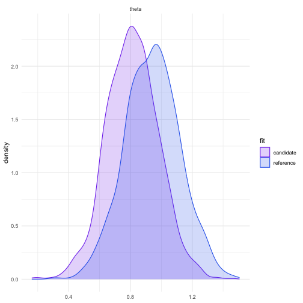
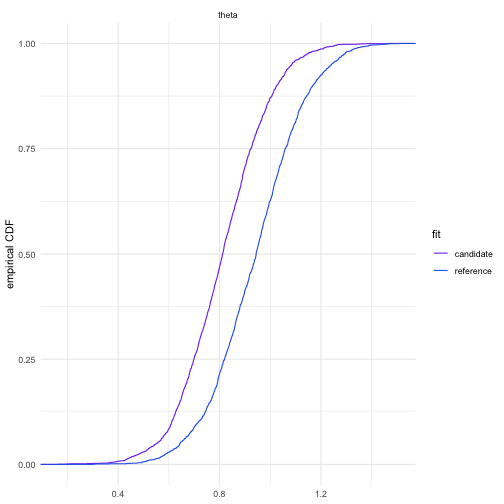

# FD prior sensitivity: Gaussian location model

This notebook walks through the simplest `fdsens` example
([`examples/gaussian_location_prior_sensitivity.R`](../examples/gaussian_location_prior_sensitivity.R)):
fit a reference Bayesian model in Stan, measure how sensitive its posterior
is to the prior over a declared range of hyperparameters, then interpret the
result by refitting at the worst-case candidate and comparing the two
posteriors.

## The reference model

The reference model is a Gaussian location model,
`theta ~ normal(prior_mean, prior_sd)` with `y ~ normal(theta, 1)`, fit with
`cmdstanr` (see
[`inst/stan/gaussian_location.stan`](../inst/stan/gaussian_location.stan)).


``` r
library(cmdstanr)
library(fdsens)
source(file.path(repo_root, "interpretation", "plots.R"))
```


``` r
set.seed(123)
y <- rnorm(30, mean = 1)
prior_mean_ref <- 0
prior_sd_ref <- 2

stan_file <- system.file("stan", "gaussian_location.stan", package = "fdsens")
model <- cmdstan_model(stan_file, force_recompile = TRUE)

fit_reference <- model$sample(
  data = list(
    N = length(y),
    y = y,
    prior_mean = prior_mean_ref,
    prior_sd = prior_sd_ref
  ),
  seed = 123,
  chains = 2,
  parallel_chains = 2,
  iter_warmup = 500,
  iter_sampling = 1000,
  refresh = 0
)
```

## Prior sensitivity

The Stan statement `theta ~ normal(prior_mean, prior_sd)` is detected as an
exponential-family prior, so `fd_prior_global_sensitivity()` takes the exact
`quadratic_corner` route. Bounds are supplied in the normal's natural
parameters, `eta1 = mu / sigma^2` and `eta2 = -1 / (2 sigma^2)`, not in
`(mu, sigma)` directly.


``` r
prior_result <- fd_prior_global_sensitivity(
  fit = fit_reference,
  variables = "theta",
  lambda_lower = c(eta1 = -1, eta2 = -2),
  lambda_upper = c(eta1 = 1, eta2 = -0.05),
  stan_file = stan_file,
  prior_variable = "theta",
  stan_data = list(prior_mean = prior_mean_ref, prior_sd = prior_sd_ref)
)
print(prior_result)
#> FD prior sensitivity 
#>   optimisation: quadratic_corner 
#>   sensitivity: 20.976 
#>   minimum FD:  0 at lambda = (eta1 = 0, eta2 = -0.125) 
#>   maximum FD:  20.976 at lambda = (eta1 = -1, eta2 = -2)
```

`prior_result$sensitivity` is the global sensitivity value: the largest
change in FD achievable by moving the prior's natural parameters anywhere in
the declared box. `prior_result$lambda_max` is the worst-case candidate,
i.e. the hyperparameter choice producing the greatest posterior change.

## Interpreting the result: refit at the worst case

`lambda_max` is in natural parameters; invert it back to `(mu, sigma)` to
refit the candidate model.


``` r
lambda_max <- prior_result$lambda_max
sigma_candidate <- sqrt(-1 / (2 * lambda_max["eta2"]))
mu_candidate <- lambda_max["eta1"] * sigma_candidate^2

fit_candidate <- model$sample(
  data = list(
    N = length(y),
    y = y,
    prior_mean = as.numeric(mu_candidate),
    prior_sd = as.numeric(sigma_candidate)
  ),
  seed = 123,
  chains = 2,
  parallel_chains = 2,
  iter_warmup = 500,
  iter_sampling = 1000,
  refresh = 0
)
```

With both fits in hand, compare the reference and worst-case posteriors
using the helpers in
[`interpretation/plots.R`](../interpretation/plots.R). Each helper also
writes its output (a table or a plot) to `output_dir`.


``` r
fits <- list(reference = fit_reference, candidate = fit_candidate)
output_dir <- file.path(repo_root, "interpretation", "output", "gaussian_location_prior")

save_sensitivity_result(prior_result, output_dir = output_dir)
quantile_table <- plot_quantiles(fits, variables = "theta", output_dir = output_dir)
quantile_table
#>         fit variable      mean        sd        5%       25%       50%
#> 1 reference    theta 0.9416845 0.1775662 0.6440444 0.8197950 0.9445155
#> 2 candidate    theta 0.8140425 0.1665567 0.5534887 0.6991577 0.8122724
#>         75%      95%
#> 1 1.0593146 1.240480
#> 2 0.9236236 1.084733
```


``` r
kde_plot <- plot_kde(fits, variables = "theta", output_dir = output_dir)
kde_plot
```




``` r
ecdf_plot <- plot_ecdf(fits, variables = "theta", output_dir = output_dir)
ecdf_plot
```



The worst-case candidate prior visibly shifts and tightens `theta`'s
posterior relative to the reference — consistent with the nonzero global
sensitivity value reported above.
